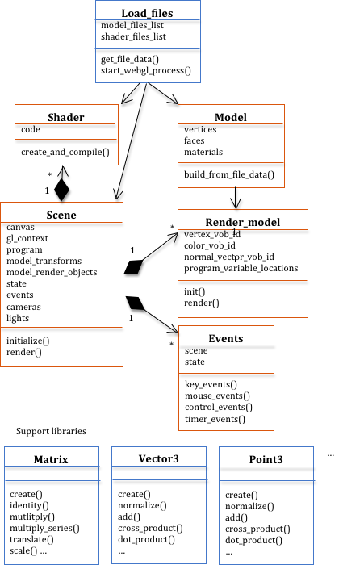

# Software Organization For WebGL programs

Программа WebGL состоит из значительного количества программного обеспечения. Без хорошей организации программного обеспечения и абстракции ваша способность поддерживать и улучшать эти графические программы со временем будет значительно уменьшена. Большинство программистов ненавидят навязывать им предписанную структуру программного обеспечения. Есть много способов разработки программного обеспечения, и хороший дизайн, сделанный одним программистом, может сбить с толку другого программиста. Но нельзя обойти стороной тот факт, что необходима хорошо продуманная структура программного обеспечения.

JavaScript поддерживает объектно-ориентированное программирование, и программное обеспечение в этих руководствах разработано как набор объектов по следующим очень важным причинам:

* В глобальном адресном пространстве Javascript есть большое количество переменных и функций. Вы всегда должны разрабатывать программное обеспечение, которое ограничивает количество значений и функций, определенных глобально, но тем более для JavaScript. Это защищает вас от перезаписи и переопределения встроенных функций Javascript.
* Хорошая разработка программного обеспечения требует, чтобы данные и связанные с ними функции были объединены в логическую единицу. Это создает логическую организацию вашего кода и защищает данные внутри каждого объекта от случайного изменения.
* Ваш код должен быть структурирован таким образом, чтобы облегчить рендеринг нескольких 3D-графики в нескольких окнах холста на одной веб-странице. Создание классов Javascript, которые можно использовать для создания отдельных экземпляров объекта, по одному для каждого рендеринга холста, имеет смысл.
* Часть вашего кода Javascript может быть достаточно универсальной, чтобы ее можно было **повторно использовать в различных графических проектах**. Другой код будет очень специфичным для программы. Если вы не отделяете общий код от кода программы, вы ограничите повторное использование кода. Приложения WebGL сложны, и вы захотите повторно использовать код как можно чаще.
* Код WebGL очень взаимозависим. Если вы измените одну инструкцию в программе шейдера, вам может потребоваться изменить многие аспекты вашего связанного кода Javascript. Это поможет вам отделить взаимозависимый код от другого «автономного» кода.
* Невозможно переоценить важность изоляции кода **однократной инициализации** от **многократно выполняемого кода рендеринга**. В вашем коде должно быть четко указано, какая логика выполняется только **один раз** в качестве этапа **предварительной обработки**. Это упростит вам оптимизацию графики для скорости рендеринга в реальном времени.

Пример структуры программного обеспечения, используемого в этих руководствах, показан на схеме UML (Unified Modeling Language) ниже. Стрелки указывают на отношения. Классы в **синих** прямоугольниках представляют собой статические библиотеки Javascript, которые остаются неизменными от одной программы WebGL к другой. Классы в **оранжевых** полях - это код Javascript, который изменяется в зависимости от сложности и типа создаваемой графики.

> Сцена обычно состоит из нескольких моделей. Имеет смысл создавать объект для каждой модели. Это изолирует сложность каждой модели в отдельном объекте JavaScript и значительно упрощает повторное использование кода.

Чтобы узнать, как разрабатывать программы WebGL, вы начнете с простого рабочего примера и измените небольшие части системы за один раз. Однако по мере того, как мы представляем передовые концепции графики, многие части программного обеспечения должны будут измениться одновременно. Это одна из причин, почему мы начинаем эти уроки, имея в виду общую картину. Вам нужно узнать, как небольшие изменения в одной части программного обеспечения распространяются на другие части.

Поскольку вы будете изучать примеры кода и изменять существующий код, нам нужно обсудить стандарты кодирования в следующем разделе.